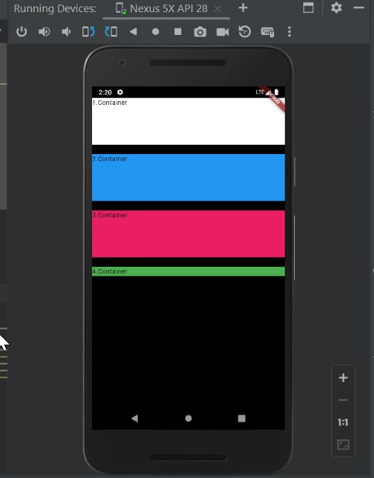
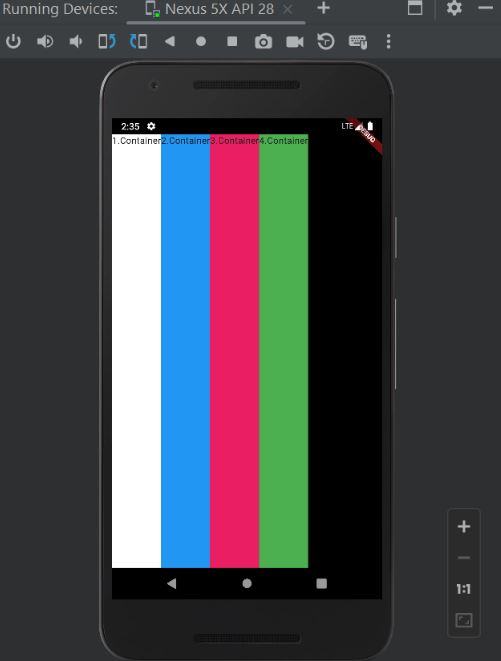
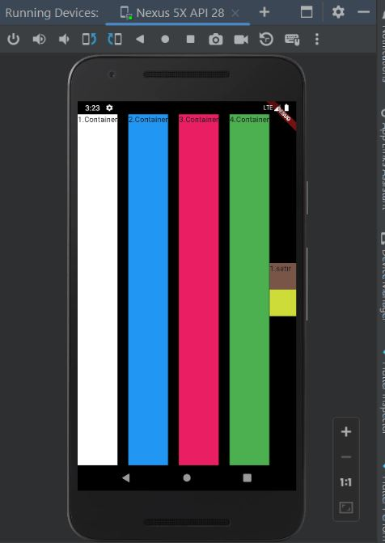

# Column ve Row Pratikleri

Bu proje, Flutter'da `Column` ve `Row` widget'larını kullanarak yapılan pratikleri içermektedir. Ayrıca, ekseriyetle kullanılan eksenler, hizalama ve `Container` kavramları üzerinde durulmuştur.

## Getting Started

Bu bölümde, projenin temel kavramlarına hızlı bir bakış bulacaksınız.

### Eksenler

Eksenler, `mainAxisSize`, `mainAxisAlignment` ve `crossAxisAlignment` özellikleri ile kontrol edilebilir.

Örnekler:
```
mainAxisSize: MainAxisSize.min
mainAxisAlignment: MainAxisAlignment.start
mainAxisAlignment: MainAxisAlignment.end
mainAxisAlignment: MainAxisAlignment.center
```
### Hizalama (Alignment)
Örnekler:

```
mainAxisAlignment: MainAxisAlignment.spaceBetween
crossAxisAlignment: CrossAxisAlignment.center
crossAxisAlignment: CrossAxisAlignment.stretch 
```

### Container
Container widget'ı, bir kutucuğun boyutlarını belirlemek ve içindeki widget'ları sarmak için kullanılır.

Örnek:
```
Container(
  color: Colors.white,
  width: 200,
  height: 100,
  child: Text('1. Container'),
),
```

### Ekran Görüntüleri









