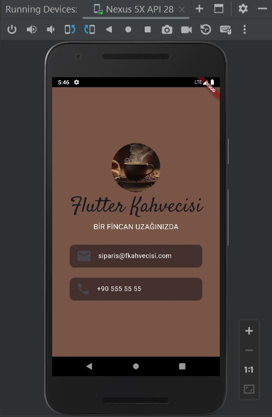

# flutter_kahvecisi

Bu proje, basit bir kahve dükkanı profil sayfasını temsil eden, Stateless yapıda bir Flutter arayüzü oluşturmayı amaçlamaktadır.
## Başlangıç

-Resim Ekleme:
Projeye eklemek istediğiniz görselleri pubspec.yaml dosyasında tanıtmanız gerekmektedir.
circleavatar özelliğini kullanarak resmi kolay bir şeklide daire içine alabilirsiniz
```
 assets:
    - images/caf.jfif

```
-Font Ekleme
Projeye özel fontları eklemek için, Google Fonts veya benzeri bir kaynaktan indirdiğiniz font dosyasını pubspec.yaml dosyanıza ekleyebilir ve projede kullanabilirsiniz.
```
  fonts:
    - family: Satisfy
      fonts:
        - asset: fonts/Satisfy-Regular.ttf


```
#Kullanılan Widgetlar

-CircleAvatar: Kullanıcı profil resmini daire içine almak için kullanıldı.

-Text: Başlık ve alt başlık metinleri için kullanıldı.


-Divider: İki bölüm arasında ayırıcı çizgi eklemek için kullanıldı.

-Card ve ListTile: İletişim bilgilerini içeren kartları oluşturmak için kullanıldı.

#Ekran Görüntüsü
